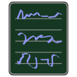
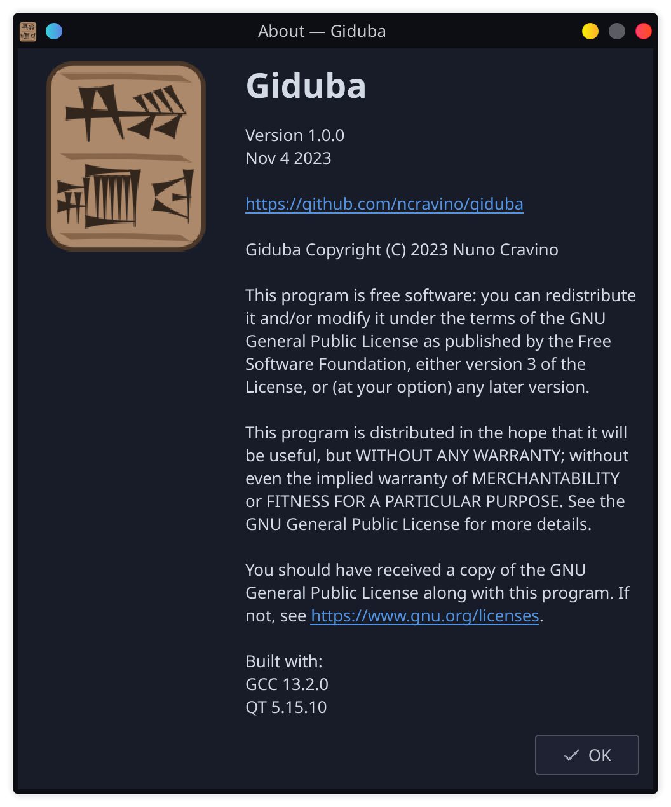

# Giduba



A lean, small, and simple text editor / notepad alternative in QT.

The goal of this editor is to be a drop in replacement for MS Notepad in Linux, as a very simple and fast text editor.

This code is licensed under the GNU Public License Version 3, see [LICENSE](./LICENSE) for details.

This is not a code editor.

Giduba is the sumerian word for writing utensils, literally a reed that was cut and used to write cuneiform on a clay tablet.

## Features

- Read unicode files
- Write UTF8
- Character, word, line counter
- Word Wrapping
- Search and Replace
- Fast and Small (<100KB)
- Open file via argument
- .deb and .tar.gz releases

## Todo

- ~~Add Search & Replace~~
- ~~Add configuration file~~
- ~~Fix status bar focus bugs~~
- ~~Make sure icon works in KDE~~
- ~~Add command Line Options~~
- ~~Save window state (dimensions et al.)~~
- ~~Refactor into multiple files~~
- ~~Create .deb and .tar.gz releases~~

## Building

### Requirements

- qtwidgets >= 5.0
- qmake
- make 

### Compiling Source

- `make build`

The binary will be under `./build/giduba`.

### Testing 
- `make run`

### Installing
WIP

## Configuration

Configuration is done using the file `$HOME/.config/giduba/giduba.conf`.

### Default Configuration

The file will be created and filled with the default configuration on the first run.

```
[General]
always_show_bar=true
default_font_size=12
default_wrap=true
max_file_size_mb=512
```

### Configuration Keys

- `always_show_bar`:  a boolean that defines whether or not to always show the scroll bars (note that the horizontal will be hidden if wrap is true).
- `default_font_size`: an integer defining the default font size for the editor
- `default_wrap`: a boolean defining wether or not to wrap text (acording to window dimensions)
- `max_file_size_mb`: an integer to limit on the maximum file size that can be opened. In megabytes.

Any missing key will be replaced by the default.

## Screenshots




