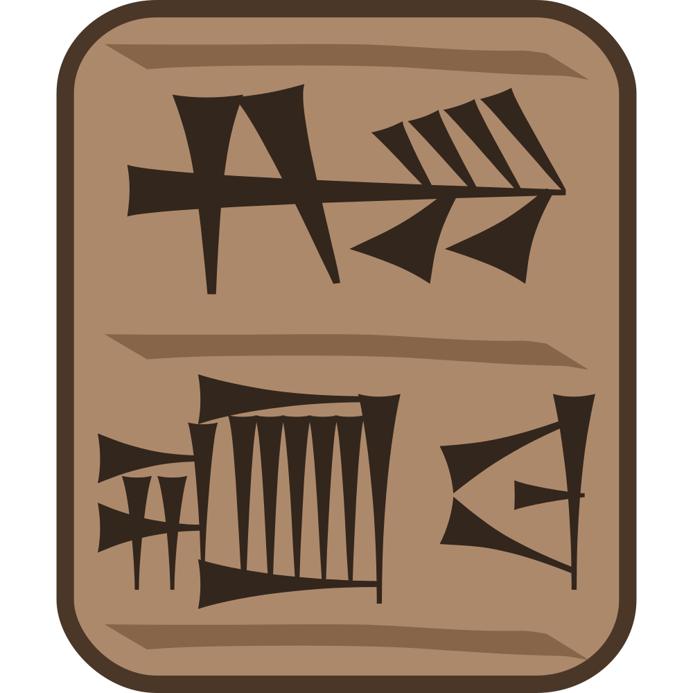

# Giduba


A lean, small, and simple text editor / notepad alternative in QT.

The goal of this editor is to be a very simple and fast text editor for quick text editing tasks such as viewing/changing config files, paste buffering, etc.

This code is licensed under the GNU Public License Version 3, see [LICENSE](./LICENSE) for details.

This is not a code editor.

Giduba is the sumerian word for writing utensils, literally a reed that was cut and used to write cuneiform on a clay tablet.

## Features

- Configurable via `~/.config/giduba/`
- Read unicode files
- Write UTF8
- Character, word, line counter
- Word Wrapping
- Search and Replace
- Fast and Small (around 80KB in x86_64)
- Open file via argument
- Save last window geometry

## Installing

You can find both .deb, AppImage, and .tar.gz releases in [https://github.com/ncravino/giduba/releases](https://github.com/ncravino/giduba/releases).

To install a .deb, simply download it and run:
- `sudo dpkg -i filename.deb`

If you don't have all the dependencies just follow the instructions that dpkg prints.

It has been tested in Debian 11 and 12, please let me know if you run into any issue.
I'm working on testing under Mint and Kubuntu, ARM, and other operating systems (as long as QT is available there it should build).

## Building

### Requirements
- make 
- qt5-qmake 
- qtbase5-dev 
- build-essential

Under Debian based distributions use `make deb-install-build-depends`.

### Compiling Source

- `make build`

The binary will be under `./build/giduba`.

## Configuration

Configuration is done using the file `$HOME/.config/giduba/giduba.conf`.

### Default Configuration

The file will be created and filled with the default configuration on the first run.

```
[General]
font_size=12
max_file_size_mb=512
show_scroll_bars=true
wrap=true
```

### Configuration Keys

- `show_scroll_bars`:  a boolean that defines whether or not to always show the scroll bars (note that the horizontal will be hidden if wrap is true).
- `font_size`: an integer defining the default font size for the editor
- `wrap`: a boolean defining wether or not to wrap text (acording to window dimensions)
- `max_file_size_mb`: an integer to limit on the maximum file size that can be opened. In megabytes.

Any missing key will be replaced by the default.

## Screenshots


