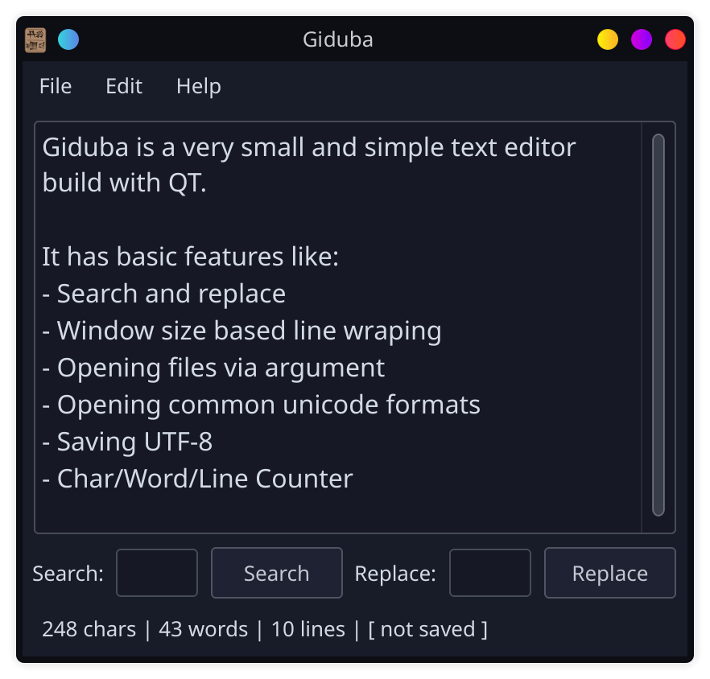

# Giduba

A lean, small, and simple text editor / notepad alternative in QT.

The goal of this editor is to be a drop in replacement for MS Notepad in Linux, as a very simple and fast text editor.

This is not a code editor.

Giduba is the sumerian word for writing utensils.

## Features

- Read unicode files
- Write UTF8
- Character, word, line counter
- Word Wrapping
- Fast and Small (~55KB)

## Todo

- Add Search & Replace
- Add configuration file
- ~~Fix status bar focus bugs~~
- Make sure icon works in KDE
- Save window state (dimensions et al.)
- Add tests
- Create .deb and .tar.gz releases

## Screenshots

